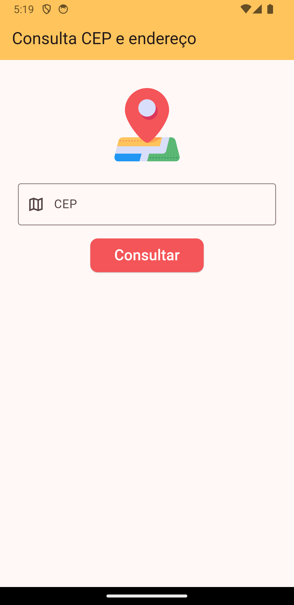
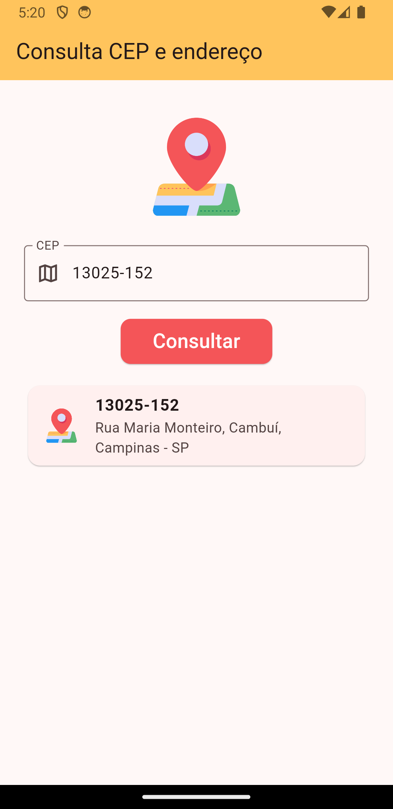
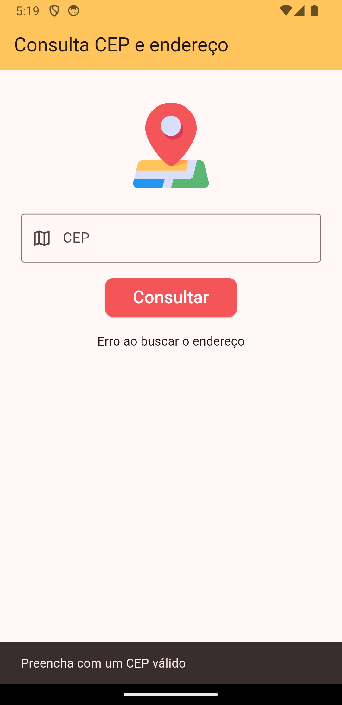

<p align="center">
       
  <h1 align="center">Address Finder App</h1>
</p>

A Flutter application that allows users to input a Brazilian CEP (Código de Endereçamento Postal) code and retrieve the corresponding address information. 

<p align="center">
    
   
</p>

## Table of Contents

* [Features](#features)
* [Installation](#installation)
* [Getting Started](#getting-started)
* [Built With](#built-with)
* [Contributing](#contributing)
* [License](#license)

## Features

- [ ] Users can easily input any valid Brazilian CEP code
- [ ] The app fetches and displays the complete address, including street name, neighborhood, city, state, and postal code
- [ ] Provides informative error messages for invalid CEP codes

## Installation

**You need to install the [Flutter SDK](https://docs.flutter.dev/) and configure the [Android toolchain development](https://docs.flutter.dev/get-started/install/windows/mobile?tab=download#configure-android-development) first and then, in order to clone the project via HTTPS, run this command:**

```git clone https://github.com/jaquedreyer/address-finder-app.git```

SSH URLs provide access to a Git repository via SSH, a secure protocol. If you have a SSH key registered in your Github account, clone the project using this command:

```git clone git@github.com:jaquedreyer/address-finder-app.git```

**Install dependencies**

```flutter pub get```

## Getting Started

Run the following command in order to start the application in a development environment:

```
flutter run
```

## Built With

- Core
  - [Flutter](http://www.dropwizard.io/1.0.2/docs/) - An open source framework by Google for building multi-platform applications 
  - [Dart](https://maven.apache.org/) - The programming language 
- Packages
  - [bloc](https://pub.dev/packages/flutter_bloc) - State management approach
  - [http](https://pub.dev/packages/http) - For making HTTP requests
- API
  - [ViaCEP](https://viacep.com.br) - A reliable API for fetching address data based on CEP codes 
- Project Structure
  - [Clean Arch](https://blog.cleancoder.com/uncle-bob/2012/08/13/the-clean-architecture.html) - Separate the different components of an application, creating modular, testable, and maintainable code
  
 
## Contributing

I welcome contributions and suggestions from the community! If you come across any issues, have ideas for improvements, or wish to contribute in any way, feel free to open an issue or submit a pull request.  **I would love to learn with you**! 

## License

Released in 2024. This project is licensed under the [MIT License](LICENSE.md).

> Made with love by Jaque Dreyer 🧡


